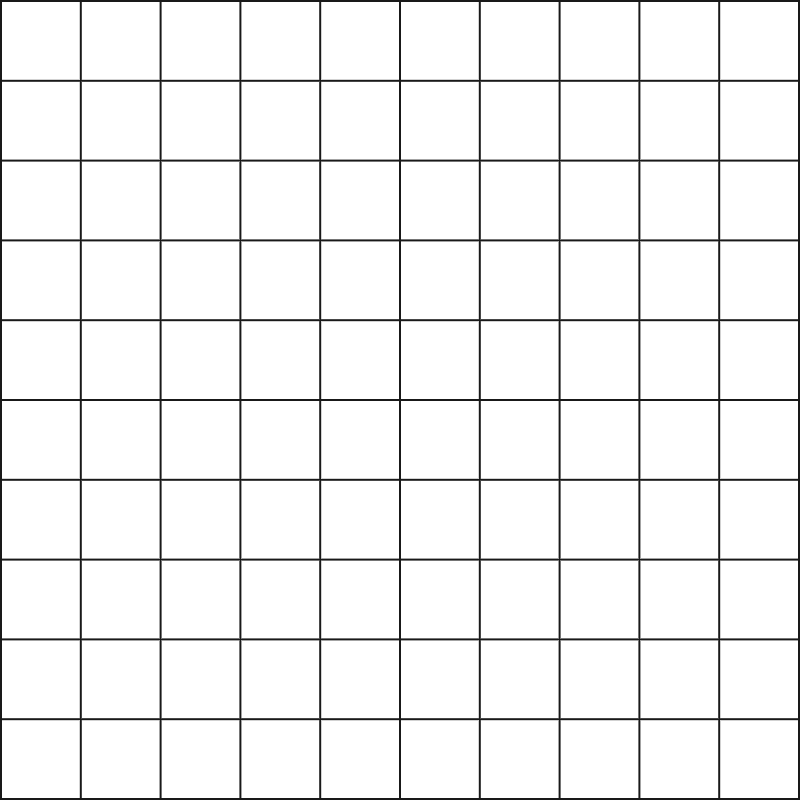

# Distributed Environment

In this project we will write an environment in wich several players will be able to interact.

## Simple environment

First we will begin designing the environment. For simplicity we will consider a 2D grid world, in wich players will take a cell.

First we will create an HTML file that we will be able to show:

```html
<!-- index.html -->
<!DOCTYPE html>
<html>
  <head>
    <meta charset="utf-8" />
    <title>Distributed Game</title>
  </head>

  <body>
    <script src="/js/main.js"></script>
  </body>
</html>
```

And now we move to the logic of our environment. We will use the HTML5 canvas to draw it:

```javascript
// main.js
const WIDTH = 800;
const HEIGHT = 800;

const ROWS = 10;
const COLS = 10;

const PADDING = 2;

function init(cvs) {
  cvs.height = HEIGHT;
  cvs.width = WIDTH;
}

function draw(ctx) {
  ctx.fillStyle = "#191919";
  ctx.fillRect(0, 0, WIDTH, HEIGHT);
}

window.onload = () => {
  let cvs = document.createElement("canvas");
  document.body.appendChild(cvs);
  init(cvs);

  let ctx = cvs.getContext("2d");
  draw(ctx);
};
```

Notice the declared functions `init` and `draw` that will become helpful for the organisation of our code.


Now we will draw a grid updating the `draw` function. Additionally we will define a helper function to translate from grid coordinates to pixel coordinates:

```javascript
// main.js
// ...
const H = (HEIGHT - PADDING) / ROWS - PADDING;
const W = (WIDTH - PADDING) / COLS - PADDING;

function toPixels({ i, j }) {
  return {
    x: j * (W + PADDING) + PADDING,
    y: i * (H + PADDING) + PADDING,
  };
}

function draw(ctx) {
  // ...

  ctx.fillStyle = "#FFFFFF";

  for (let i = 0; i < ROWS; i++) {
    for (let j = 0; j < COLS; j++) {
      let { x, y } = toPixels({ i, j });
      ctx.fillRect(x, y, w, h);
    }
  }
}
```



### Adding interactivity

We will represent the user position as a green square. For this we define an object holding user data, and update our draw function:

```javascript
// main.js

let user = {
  i: 5,
  j: 5,
};

function draw(ctx) {
  // ...
  // Draw user
  ctx.fillStyle = "#00FF00";
  let { x, y } = toPixels(user);
  ctx.fillRect(x, y, W, H);
}
```

Something interesting we could do now is allow the user to move around the grid. We could use the "WASD" keys with an event listener the following way:

```javascript
window.addEventListener("keydown", (k) => {
  switch (k.code) {
    case "KeyA":
      console.log("left");
      user.j -= 1;
      break;
    case "KeyD":
      console.log("right");
      user.j += 1;
      break;
    case "KeyW":
      console.log("up");
      user.i += 1;
      break;
    case "KeyS":
      console.log("down");
      user.i -= 1;
      break;
  }
});
```

However we will notice that, even though the logs are correct, the square doesn't move. This is because we draw the grid once, and we never refresh it. For this we will introduce the function `update` that will be executed every frame, and the frame loop.

```javascript
// main.js
function update(dt) {
  // TODO: broadcast current position
  // TODO: update board with server info
}

window.onload = () => {
  // ...

  let start = undefined;
  window.requestAnimationFrame(function step(ts) {
    if (start === undefined) start = ts;
    const dt = start - ts;

    update(dt);
    draw(ctx);

    window.requestAnimationFrame(step);
  });
};
```

Notice that we will use the update function to contact with the server every frame. We will consider a simple communication protocol in which the user sends the action it wants to perform and the server answers:

- The current location for the user.
- The location of other users.

#### Server Side

TODO

#### Client Side

TODO
